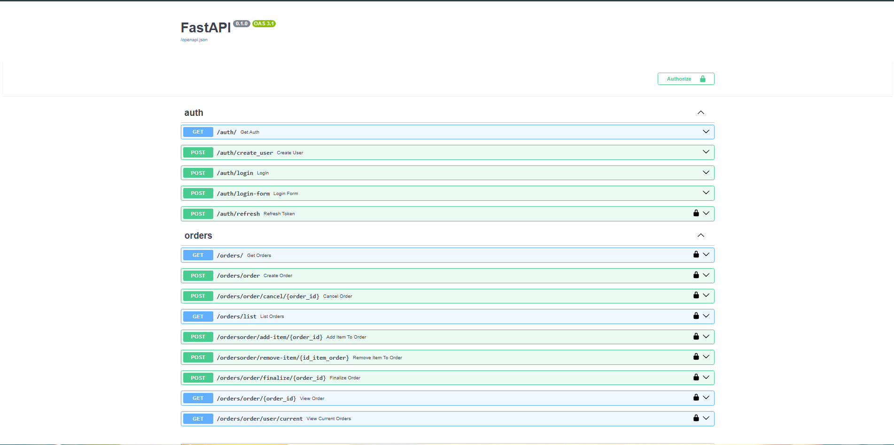
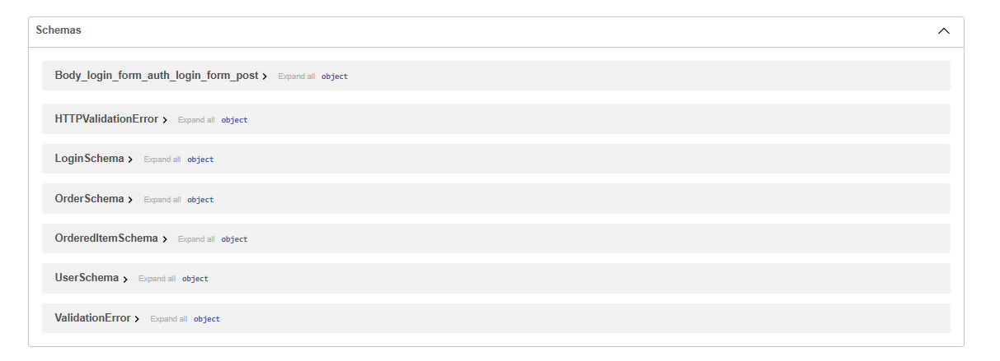
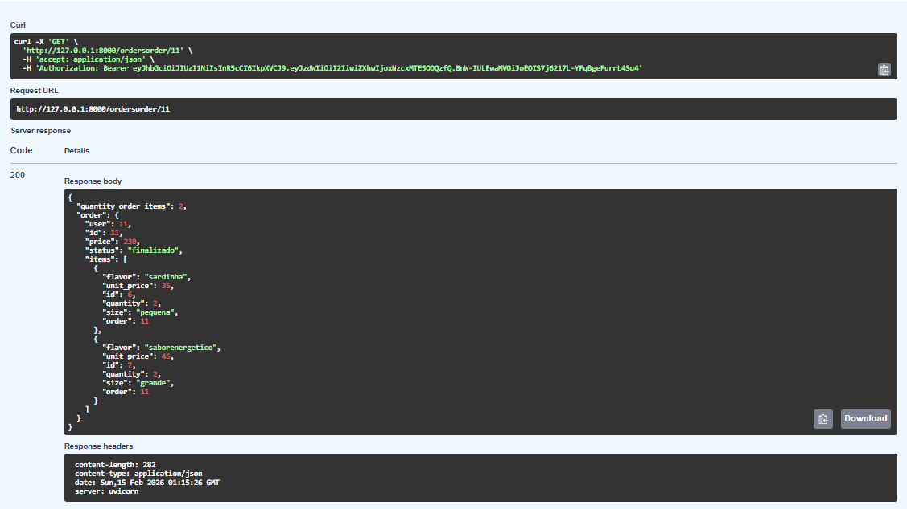
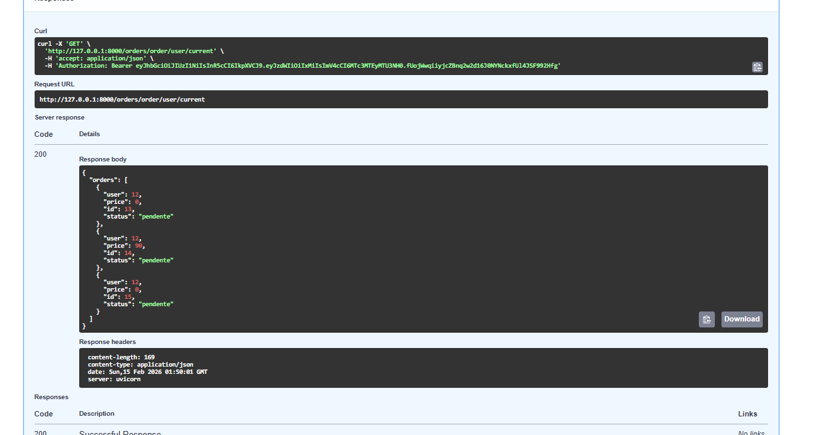

 
 
 
 uvicorn main:app --reload = run the server

 ## Configuração Inicial

 1.  Instalar as dependencias
 2.  Instanciar o fastAPI
 3.  Criar o arquivo das rotas (rota de auth / rota de order)
 4.  Importar nossas rotas no main.py
 5.  Criar um roteador para cada rota com o APIRouter / definir o prefix para as rotas / definir tags para deixar aparecendo na documentação
 6.  Dizer ao main para ele usar os roteadores (minhas rotas)

 ## Criação de Rota De Criação de conta

 1.  Usar um decorator mais o seu roteador, passando o status HTTP e o endpoint
 2.  Criar uma função assincrona para a rota 
 3. Passar os parametros / tipados 
 4. Verificar se ja existe um usuário com esse email (trazer a tabela de usuarios para ter acesso e fazer essa busca + trazer a variavel do banco)
 4. Criar uma session com o *sqlalchemy.orm import sessionmarker* para evitar ficar com conexões abertas no nosso banco. Cria uma sessão faz oq tem que fazer depois deleta a sessão 
 5. Chamar a session *session =  sessionmaker(bind=db)* Criar uma instancia da session *session = session()*
 6. umar a session Fazer uma query na minha tabela usser e filtrar um email do usuario do banco se é igual ao email passado no parametro, utilizar metodo first()
 7. Se ja existir um usuario (já existe um usuario com esse email, return uma msg), se não cria ele
 8. utilizar a nossa session.add(new_user), para armazenar no nosso banco de dados dentro da session
 9. Utilizar o session.commit()
 10. retornar um JSON com uma message do usuario criado
 11. Refatorar a parte de session para utlizar a dependencia
 12. Encriptografar a senha
 13. import o HTTPException para definir o status http da nossa request, passando o status_code / detail
 14. Sempre quando o usuario for fazer algo que não deve, não devemos usar o return e sim o raise, quando se trata de devolver o status_http

## Criação de Rota De Login da conta

1. Na rota de login, vamos passar nosso email e senha, nossa API vai devolver um token, aonde com esse token eu vou usar em todas as rotas que pede que tenha um usuario logado
2. Iremos utilizar o formato token via (JWT)
3. Criar um Schema para o login recebendo como parametro do schema o email e a senha
4. tipando a Session e usando o Depends junto com nosso method Depends(get_session)
5. Fazer uma consulta no banco, para chekar se existe de fato esse usuario com o respesctivo email
6. Se não existir o usuario, retornar => raise HTTPException(status_code=404, detail="user not found")
7. Caso exista um usuario no bloco else. Criar um usuario
8. Criar uma função authenticate_user que recebe 3 parametros(email, password, session)
9. realiza a query no banco para ver se existe um usuario com aquele email user = session.query(User).filter(User.email == email).first()
10. Verifica se tem ou não com condicional
11. Faz a verify do password, com a senha que inserimos, com a senha cadastrada no banco
12. Se tudo der certo retorna o user
13. chamamos a função dentro da rota, passando os 3 parametros user = authenticate_user(loginSchema.email, loginSchema.password, session)
14. utilizamos o access_token e o refresh_token que vem da função create_token()
15. Para o access_token, passamos o id do usuario
16. para o refresh_token, como segundo parametro, passamos o duration
17. retornamos em um dicionarios
      return {
          "access_token": access_token,
         "refresh_token": refresh_token,
         "token_type": "Bearer",
     }

## Criação de Rota De Criar Pedido

1. Definir o endpoint /order
2. Criar uma função assincrona create_order, que recebe como parametros, nosso orderSchema, e a nossa getSession
3. orderSchema: OrderSchema, session: Session = Depends(get_session)
4. Adicionar um bloco try e except
5. Dentro do try vamos criar uma new_order = Order(user=orderSchema.user)
6. utilizar o session.add(new_user) - Coloca o objeto na fila para ser salvo.
7.Utilizar o session.commit() - Executa o INSERT no banco - Persiste os dados
8. Usar o session.refresh(new_order) - garante que o id vem atualizado
9. No bloco except tipamos ele Exception as e
10. Usamos o session.rollback() - evita salvar coisa quebrada no banc
11. raise HTTPException(status_code=500, detail="error creating order")
12. Para todas as rotas de pedidos adicionamos uma dependencia global de verify_token 
13. order_route = APIRouter(prefix="/orders", tags=["orders"], dependencies=[Depends(verify_token)])
14. Isso priva as rotas apenas para usuarios autenticados
15. Usar como parametro da função(user: User = Depends(verify_token)) Que a dependecia verify_token, nos retorna o user

## Criação de Rota De Listar Pedidos
1. Endpoint /list
2. Criar uma função asyncrona passando 2 dependencias, session e user
3. Verificar se o usuario é admin
4. Se não for admin retornar um arro com raise HTTPException
5 - Se for admin fazer a query no banco na tabela Orders, usando o metodo all(), retornando todos os pedidos

## Criar a funcionalidade de adicionar um Item ao nosso Pedido
1. Criar a rota order/add-item/{order_id}
2. Criar a função asyncrona que recebe 4 parametros
3. order_id: int, orderedItemSchema: OrderedItemSchema, session: Session = Depends(get_session), user: User = Depends(verify_token)
4. Fazer a query no banco na tabela Order
5. Verificar se existe um Pedido
6. Verificar se o usuario é o dono do pedido ou admin
7. Criar uma variavel ordem_item = que vai receber OrderedItem() a class do meu model, passando todos os valores atravez do meu esquema
8. Calcular o price
9. session.add(ordem_item) para deixar ja preparado pra subir pro banco
10. session.commit() O que de fato vai da o INSERT no banco
11.     return {
        "message": "Item added sucessfully",
        "item_id": order_item.id,
        "order_price": order.price
    }

## Como Calcular o Price
. Antes de tudo isso precisamor ter acesso aos items da tabela de OrderedItem
. Criamos uma nova coluna chamada items, que recebe  relationship("OrderedItem", cascade="all, delete")
. Basicamente tamo atribuindo a essa tabela de Order, o poder de acessar valores de outra tabela pelo relationship + nome da tabela
. from sqlalchemy.orm import relationship
. O cascade
1. Dentro do model Order
2. Criar uma função calculate_price(self)
3. Fazer um loop com for pra cada item em self.item
4. armazenar dentro de self.price += item.quantity * item.unit_price
5. retornar o self.price

## Criação de Rota De Cancelar Pedido
1. Definir o endpoint  /order/cancel/{id_order}
2. Criar uma função asyncrona recebendo uma instancia do banco de dados session: Session = Depends(get_session)
3. Buscar com um query o pedido order = session.query(Order).filter(Order.id == order_id).first()
4. Se não tiver pedido, raise HTTPException(status_code=404, detail="order not found")
5. Alterar o status do order para cancelado
6. utilizar o session.commit() para fazer as alterações no banco
7. retornar um objeto com a primeira chave uma message, e segunda chave o pedido e as informações
8. Nessa rota de cancelar pedido precisamos fazer um certo tratamento, para saver quem pode cancelar o pedido, apenas o usurio dono do pedio, ou usuario admin
9. Criar nivel de acesso a rota, precisa garantir q essa rota receba como parametro o usuario que esta fazendo aquela requisição
10. A rota ja tem o bloqueio via token, então ja temos a garantia, que o usuaio ta logado e é valido, mas precisamos saber se ele e o dono do pedido ou admion
11. Fazer a verificação if not (user.admin or order.user != user.id):
12. O user.id vem do "sub" do meu verify_token atraves da dependencia ele so me retorna o user.id

## Gerenciamento de Sessão

 1. Se eu tiver varias rotas que edita meu banco de dados, significa que eu vou ter que repetir esse codigo em cada rota, em cada parte do codigo
 2. Todas as rotas que formos criar dependem de uma sessão
 3. O session close, que encerra a sessão, não podemos apenas colocar por fim de cada rota, pois se existir um erro no meio da rota, ela nunca é executada, não finalizando a sessão
 4. Criar uma dependencia python = E uma função que vai me retornar um parametro ou algo que precisamos, vindo de um arquivo externo dentro do nosso codigo, simplificando nosso codigo e deixando limpo
 5. Importar nossa dependencia get_session, que é uma função, onde lida com as sesion, atribuir como parametro e importar do fastAPI o Depends() para informar que esse parametro não vem do usuario
 6. No lugar de retornar a session, usamos o yield, ele retorna um valor, mas n encerra a execução da função
 7. Fechar a sessão - session.close()
 8. envolver todo nosso sesseion dentro de um try: pra tentar executar aquele pedaço e no finally executar o session.close()

## Criptografia de Senha

1. Instalar a ferramenta bcrypt para a emcripitação
2. Definir uma SECRET_KEY no meu .env
3. atraves da lib dotenv from load_dotenv pegamos a nossa variavel
4. SECRET_KEY = os.getenv("SECRET_KEY")
5. Em nenhum lugar devemos armazenar a senha do usuario descriptografada
6. Criar no main nosso bcrypt_context = CryptContext(schemes=["bcrypt"], deprecated="auto")
7. Realizar o hash da senha que o usuario esta enviando no nosso site, para armazenar ja a senha encriptada password_encrypted = bcrypt_context.hash(password)
8. Passar a senha encriptada no lugar da senha padrão

## Criação de Schemas

1. Criar um arquivo schemas.py
2. Forçar a tipagem dos dados com o python usando o Pydantic
3. Criar uma classe com o nome de Schema no final
4. Importar o from pydantic import BaseModel e usar o BaseModel como parametro da função
5. Criar um objeto model_config passando como valor "from_attributes": True
6. Ele vai ser interpretado como uma classe que vai ser transformada num SQL diretamente no banco de dados, ele ta conectando no nosso modelo
7. Importar esse nosso schema, no parametro das nossas rotas
8. Remove isso async def create_user(name: str, email: str, password: str) e chama nosso schema no lugar desses valores

## Banco de dados / ORM + Criação de Tabelas

 1.  Criação + conexão com o banco de dados
 2.  Criar uma pasta / arquivo que se chama models, aonde usaremos nossa *ORM sqlalchemy*, com o banco *sqlLite*
 3.  utilizar uma const db e atribuir a função *create_engine* do nosso sqlalchemy, passando como parametro a URL do banco  => db = create_engine("sqlite:///database.db")
 4.  Criar nossa Base para o banco de dado, com o *declarative_base*
 5.  Criar as classes / tabela no nosso banco de dados
    - Usar um parametro para a classe __tablename__ setar manualmente o nome da tabela
    - Definir os valores para cada tabela
 6.  Importar da nossa orm sqlalchemy o *Column*, para tipar nossos valores
 7.  Depois de importar o *Column*, importamos tambem os tipos de dados que usaremos nas nossas tabelas, como String | Integer | Boolean | Float | ForeignKey ex: id = Column("id", Integer)
   - Parametros importantes para a criação de cada coluna na nossa classe
      - *nullable=False* = Nunca um usario ou outra coisa pode ser criado sem um ID, ou outro campo em especifico, ele torna o elemento da coluna como obrigatorio passar um valor
      - *Primary_Key=True* = Toda tabela no nosso banco de dados tem que ter uma Primary_Key, tem que ser um valor unico para cada item armazenado dentro da tabela
      - *autoincrement=True* = Indentificador para a coluna, exemplo, cada novo usuario cadastrado o ID dele vira, 1, o proximo vira 2, e por ai em diante
      - *default=False* = Quando eu crio um usuario e não passo o parametro, usamos esse atributo *exemplo: is_active = Column("is_active", Boolean, default=True)*
      - *autoincrement=True* = Indentificador para a coluna, exemplo, cada novo usuario cadastrado o ID dele vira, 1, o proximo vira 2, e por ai em diante
      - *ForeignKey()* = Chave estrangeira, quando queremos atribuir a um valor da nossa tabela, um valor de outra tabela ex *user = Column("user", ForeignKey("users.id"))*
 8.  Criar a função __init__, responsável por inicializar os dados do objeto ao criar um novo registro, atribuindo valores aos atributos da classe. Essa função não cria tabelas nem colunas.
 9.  Tipar como um ENUM do ts, baixando a lib *sqlalchemy_utils* importando *from sqlalchemy_utils.types import ChoiceType*
    - criando uma tupla *STATUS_CHOICE = (("pendente", "pendente"), ("cancelado", "cancelado"), ("finalizado", "finalizado"))*
    - Adicionando na coluna *status = Column("status", ChoiceType(choices=STATUS_CHOICE))*

## Config + Migrations (Alembic)

 1.  Baixar a biblioteca alembic
 2.  No arquivo *alembic.ini* mudar o valor da variavel *sqlalchemy.url* para a URL do nosso banco
 3.  No arquivo env.py importar as bibliotecas *sys* e *os* e utilizar um comando
   - *sys.path.append(os.path.abspath(os.path.join(os.path.dirname(__file__), "..")))*
   - from models import Base
   - target_metadata = Base.metadata
 4.  Rodar no terminal *alembic revision --autogenerate -m "intial migration"*
   - Lê seus models
   - Compara com o estado do banco
   - Gera um arquivo de migration
   - Não cria tabelas / Não aplica nada no banco
   - Pode criar o arquivo .db vazio só por abrir a conexão (SQLite) 👉 Ele só escreve o plano, não executa.
 5.  Executar a migração *alembic upgrade head* - *usar a extensão SQLite Viewr, para visualizar as tabelas do seu banco*
 6.  A cada alteração, sendo remoção adição, deve-se criar uma nova migration no banco de dados

## Diferença do Models para Schemas

1. Model representa a estrutura da tabela no banco de dados
2. Schema representa o formato dos dados que entram e saem da API
3. Model utiliza SQLAlchemy (ORM).
4. Schema utiliza Pydantic.
5. Model é responsável por mapear dados para o banco (CRUD).
6. Schema é responsável por validar e serializar dados da requisição e resposta.
7. Model se comunica com o banco de dados.
8. Schema se comunica com o cliente (JSON da API).
9. Model = estrutura do banco.
0. Schema = estrutura da API.

## TOKEN JWT  + Refresh token 

1. Criar uma pasta chamada security
2. Criar a função dentro dessa pasta para depois exportar onde precisar
3. Utilizar o algoritimo de criptografia "H256", Definir no .env essa variavel e pegar no main
4. Definir mais uma variavel .env ACCESS_TOKEN_EXPIRES_MINUTES, Serve para definir o valor padrão de duração
5. Utilizar a biblioteca jose => from jose import jwt, jwtError
6. Utilizar a biblioteca dateTime => from dateTime import datetime, timedelta, timezone, para cuidar da parte do EXPIRE_MINUTES
7. 1 passo expiration_date definir quando vai expirar o token expiration_date = datetime.now(timezone.utc) + timedelta(minutes=ACCESS_TOKEN_EXPIRES_MINUTES)
8. Criar um dicionario com as informações que vamos codificar
9. usar o jwt.encoded() = passando 3 argumentos, 1 - meu dicionario 2 - minha SECRET_KEY, 3- o ALGORITHM
10. O refresh token é um token que tem a duração maior, porem nas requisições que serão feitas, sempre vamos mandar o access_token, o refresh_token é basicamente um token que existe 
    - pra na proxima vez que ele precisar de um novo access_token  ele não precisar me dar o email e senha dele, ele vai me dar o refresh token e eu vou gerar um novo access_token
    - quando o usuario me manda as informações de login, eu não vou gerar um unico token, vou gerar o access_token e o refresh_token
11. Diferença do acces_token e refresh_token é a duração deles
12. na função create_token, passar como segndo parametro a duration_token, por padrão é a o nosso tempo que definimos
13. Passar esse parametro na definição de expiração do token

14. def create_token(id_user, duration_token=timedelta(minutes=ACCESS_TOKEN_EXPIRES_MINUTES)):
    expiration_date = datetime.now(timezone.utc) + duration_token
    dic_info = { "sub": id_user, "exp": expiration_date }
    encoded_jwt = jwt.encode(dic_info, SECRET_KEY, algorithm=ALGORITHM)
    return encoded_jwt

    na função de login

        return {
        "access_token": access_token,
        "refresh_token": refresh_token,
        "token_type": "Bearer",
    }

## VERIFY_TOKEN

1. Criar uma função verify_token, paassando como parametro o token e a session
2. Na função que eu vou usar passar dessa forma como parametro user: User = Depends(verify_token)
@auth_route.post("/refresh")
async def refresh_token(user: User = Depends(verify_token)):
    new_access_token = create_token(user.id)
    new_refresh_token = create_token(user.id, duration_token=timedelta(days=7))

    return {
        "access_token": new_access_token,
        "refresh_token": new_refresh_token,
        "token_type": "Bearer",
    }

3. Passo 1 — FastAPI executa o Depends / Antes da rota rodar, o FastAPI executa: verify_token(...)
4. 📌 O que acontece dentro de verify_token ?
5. 1️⃣ oauth2_scheme pega o token do header / Ele pega automaticamente: / Authorization: Bearer SEU_TOKEN_AQUI / E extrai só o token.
6. 2️⃣ O JWT é decodificado / dic_info = jwt.decode(token, SECRET_KEY, algorithms=[ALGORITHM])
   . Verifica assinatura
   . Verifica expiração
   . Se estiver expirado → vai direto pro except JWTError
   . Se assinatura errada → vai pro except
   . Se estiver válido → continua
7. 3️⃣ Pega o id do usuário do payload / id_user = int(dic_info.get("sub")) / No seu create_token, você salva assim: dic_info = { "sub": str(id_user), "exp": expiration_date } Então sub é o ID do usuário.
8. 4️⃣ Busca o usuário no banco / user = session.query(User).filter(User.id == id_user).first() / Se não achar → 404 / Se achar → retorna o user
9. 📌 Então o que chega na sua rota? access_token = create_token(user.id)
10. Você está criando um novo token usando o ID do usuário.

## Anotações Derivadas

 1. Node/Express + Mongoose/Prisma → ORM/ODM cuida da sessão/conexão. Você só chama métodos.
 2. Python + FastAPI + SQLAlchemy → você precisa criar e gerenciar a session por rota.

 ## Remover o item de um pedido
 @order_route.post("order/remove-item/{id_item_order}")
async def remove_item_to_order(id_item_order: int, session: Session = Depends(get_session), user: User = Depends(verify_token)):

    item_order = session.query(OrderedItem).filter(OrderedItem.id == id_item_order).first()
    order = session.query(Order).filter(Order.id == item_order.order.id).first()

    if not item_order:
        raise HTTPException(status_code=404, detail="item not found")
    
    if not (user.admin or user.id != order.user):
        raise HTTPException(status_code=403, detail="you dont have permission to add item to this order")
    
    session.delete(item_order)
    order.calculate_price()
    session.commit()

    return {
        "message": "Item removed sucessfully",
        "quantity_order_items": len(order.items),
        "order": order
    } 

## Finalizar um Pedido

@order_route.post("/order/finalize/{order_id}")
async def finalize_order(order_id: int, user: User = Depends(verify_token), session: Session = Depends(get_session)):

    order = session.query(Order).filter(Order.id == order_id).first()

    if not order:
        raise HTTPException(status_code=404, detail="order not found")
    
    if not (user.admin or order.user == user.id):
        raise HTTPException(status_code=403, detail="you dont have permission to cancel this order")
    
    order.status = "finalizado"
    session.commit()

  
    return {
        "message": f"order {order.id} finalized",
        "order": order,
        "user": f"Pedido cancelado por {user.name}"
    } 

## Vizualizar um pedido

@order_route.get("order/{order_id}")
async def view_order(order_id: int, user: User = Depends(verify_token), session: Session = Depends(get_session)):

    order =  session.query(Order).filter(Order.id == order_id).first()

    if not order:
        raise HTTPException(status_code=404, detail="order not found")
    
    if not (user.admin or order.user == user.id):
        raise HTTPException(status_code=403, detail="you dont have permission to cancel this order")
    
    return {
        "quantity_order_items": len(order.items),
        "order": order
    }

## visualizar todos os pedidos de um usuario

@order_route.get("/order/user/current")
async def view_current_orders( session: Session = Depends(get_session), user: User = Depends(verify_token)):

    orders = session.query(Order).filter(Order.user == user.id).all()

    return {
        "orders": orders
    }

## Criar um Schema para a resposta 

1. Serve para definir quais tipos de dados vc quer exibir na saida da requisição, do que o dicionario inteiro
2. passando na requisição @order_route.get("/order/user/current", response_model=ResponseOrderSchema)
3. response_model=ResponseOrderSchema
4. Importar o from typing import List
5. Transformar minha response em uma lista tipada response_model=List[ResponseOrderSchema]